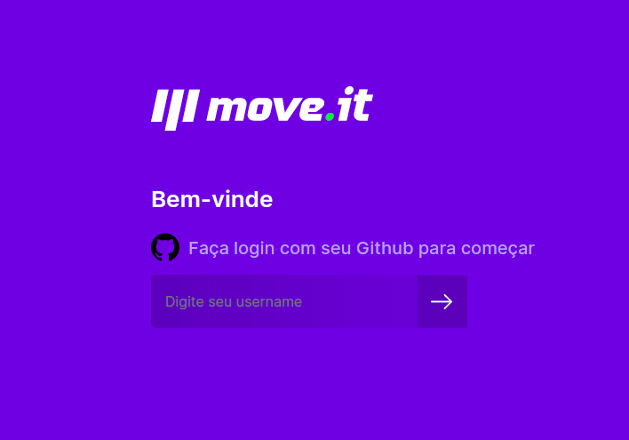
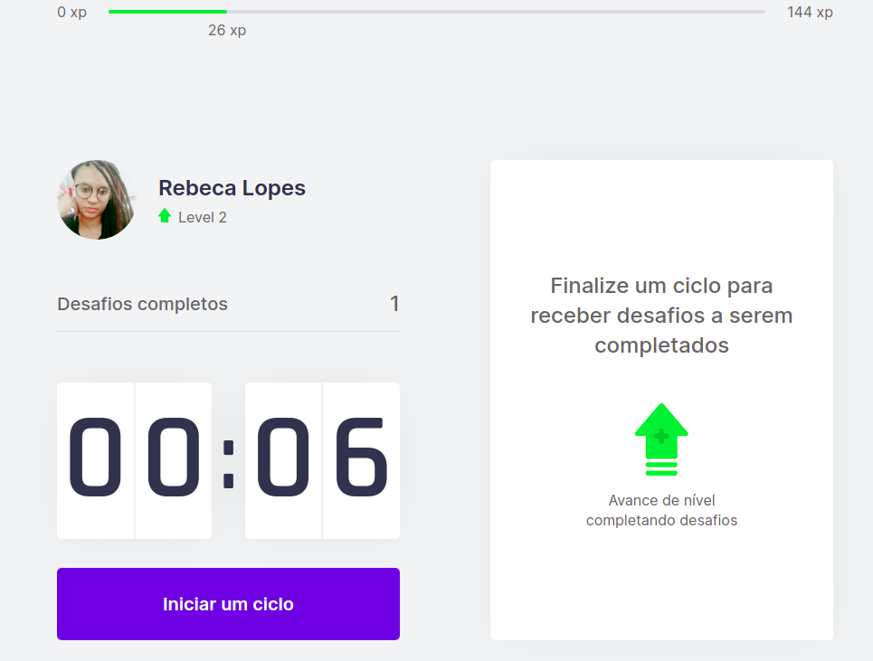
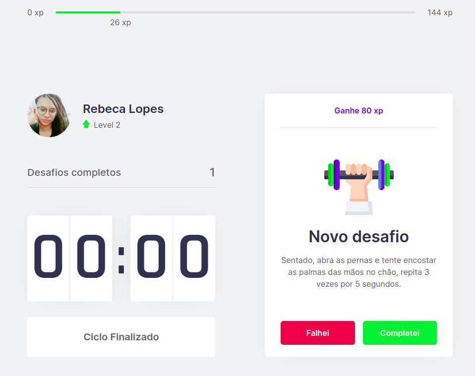
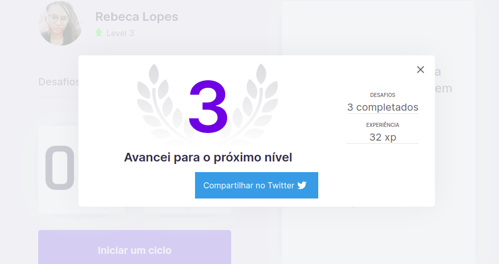

<h1 align="center">
    
    <a href="https://nlw-react-next.vercel.app/">
     Moveit</a>
</h1>

🚀 Projeto desenvolvido na semana NLW 4 da Rocketseat

 <a href="#objetivo">Objetivo</a> • 
 <a href="#executar">Rodando o projeto</a> • 
 <a href="#tecnologias">Tecnologias</a> • 
 <a href="#projeto">O projeto</a> •  

## Objetivo ✅

O objeto do projeto consiste em um contador, como um pomodoro, para que você realize exercicios rápidos, tanto para o fisico para os olhos

## Executar o projeto ⏸

Para executar o proejeto, clone-o, executando "git clone https://github.com/becatriz/nlw_react_next.git". Após rodar yarn ou npm install caso utilize NPM. Para ver o proejto rodando, verifiar se esta na mesma pasta do package.json e executar o comando yarn dev. A porta padrão utilizada é a 3000. 

## Tecnologias 🖥

    <ul>
        <li>React JS</li>
        <li>Next JS</li>
        <li>TypeScript</li>
        <li>Cookies JS</li>
        <li>Yarn</li>
    </ul>

## O Projeto 🎉

    
    
    
    

